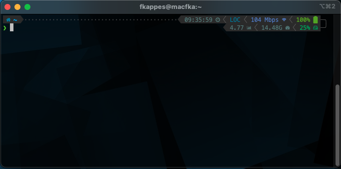

# zsh-mac
My macos zsh settings

This is not a backup of my Mac of course but all the important shell settings I use.

Containing:

* Custom extensions / commands refer to [.flowkap.zsh](.flowkap.zsh)
* [Powerlevel10K](https://github.com/romkatv/powerlevel10k) settings inside [.p10k.zsh](.p10k.zsh)
* [Oh-my-zsh](https://github.com/ohmyzsh/ohmyzsh) config inside [.zshrc](.zshrc)

Feel free to use / extend to your likelyhood :)
